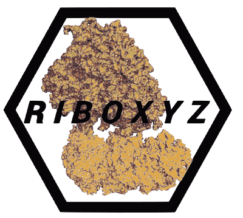

 # Overview

RiboXYZ (available at https://ribosome.xyz), a database that provides organized access to ribosome structures, with several tools for visualisation and study. The database is up-to-date with the Protein Data Bank (PDB) but provides a standardized nomenclature that allows for searching and comparing ribosomal components (proteins, RNA, ligands) across all the available structures. In addition to structured and simplified access to the data, the application has several specialized visualization tools, including the identification and prediction of ligand binding sites, and 3D superimposition of ribosomal components.

# WIP

### Datastructure:

- [ ] Pydantic 2.0

- [ ] rewrite taxonomy inference: **<<<<<<<<<<**
    - src ids and host ids separately
    - use "taxonomy.tax_infer_by_proportions" for a first-hand notion of what the structure is (add a new field ot the schema)
    - [ ] flesh out the taxonomy : [src + host] [nodes in the db, hierarchy in the app(pull in the lib, construct dynamically on app start from assets)]

- [ ] expand classification to rnas, trnas, factors
    - [ ] integrate hmm-based classification into the process pipeline
    - working on a proposoal with Khanh and Anton
    - can make progress on this without curation

- [ ] improve ligand recognition ( BIRD, CCD?):
    ### TODO:
    - BIRD has types, perhaps that's somewhat better biochemical classification
    * Added drugbank and pubchem references, that should be enough for now
    - [ ] Make sure the new types are propagated everywhere (including the api)
    - [ ] fit ligand parsing, transposition and fileformats to the new "polymeric factors" schema

# Roadmap

### Extract `ribctl` from `api` structure

- [x]  there ought to be two separate clis for both

### Datastructure

- [x] separate assemblies
- [x] split ligand classes into instances

### Structure Processing

- [ ] Logging

### Media

- [ ] render images for new structs
- [ ] re-render profiles with the new ligand schema and separate assemblies
- [ ] re-render ligands for all structs

- ligands/bsites:
    - render:
        - endpoint
        - typed [x]
        - logs
    - predict:
        - endpoint
        - typed [x]
        - logs

- superimpose:
    - typed [x]
    - endpoint
    - logs

# Debugging

- [ ] visualization troubleshoot

# DevOps:

- one-click docker deployment
- how can we benefit from github actions?

# Later:

- "last updated" section
- automatic update per struct -- cron job every 24 weeks

# LIGANDS

- ligands/ligandlike should have a common category in the db. filter the ions too. some ligands are not redndered at all (ex. 5AFI.FME)

- gene ontology + bird + CCD

## Static Files Server

Only after moving to UBC-ARC

- https://docs.djangoproject.com/en/4.1/howto/static-files/deployment/

## Integrate the PTC/conserved sites scripts scripts into the processing pipeline

